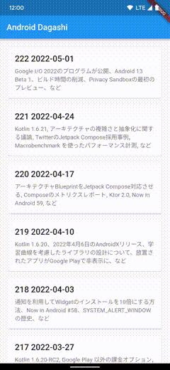

# fugashi_app

Unofficial [Android Dagashi](https://androiddagashi.github.io/) app developed with Flutter.

( [Kotlin multiplatform mobile version](https://github.com/STAR-ZERO/DagashiApp) )

## Screenshots

## Libraries

- [Riverpod](https://pub.dev/packages/riverpod)
- [Freezed](https://pub.dev/packages/freezed)
- [go_router](https://pub.dev/packages/go_router)
- [dio](https://pub.dev/packages/dio)
- [Retrofit](https://pub.dev/packages/retrofit)
